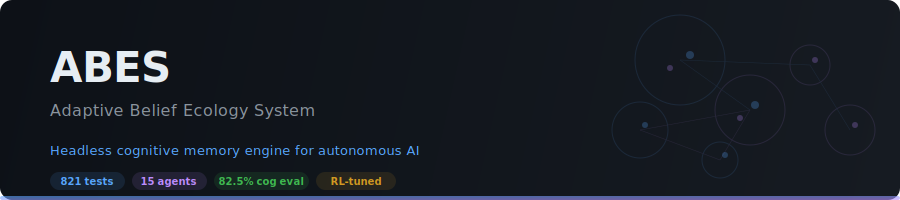
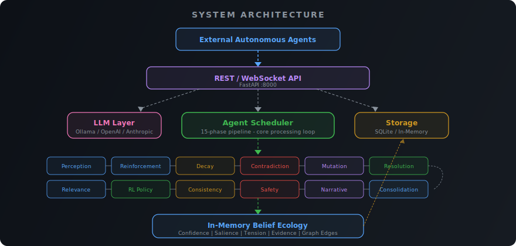
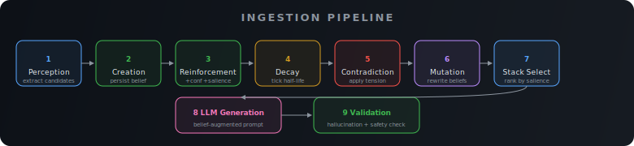
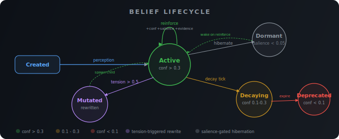
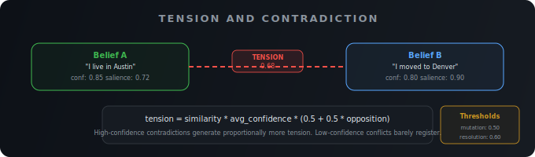
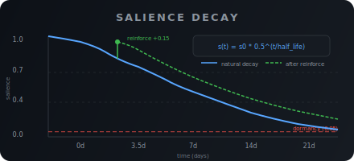

<p align="center">
  
</p>

<p align="center">
  <a href="https://www.gnu.org/licenses/agpl-3.0.en.html"></a>
  <a href="https://www.python.org/downloads/"></a>
  
  
</p>

A cognitive memory architecture where beliefs live, decay, contradict, mutate, and consolidate as a living ecology. Not a wrapper. Not RAG. Not a prompt cache. A headless memory engine for autonomous AI systems.

---

## Try in 2 Minutes

```bash
git clone https://github.com/Aftermath-Technologies-Ltd/adaptive-belief-ecology-system.git
cd adaptive-belief-ecology-system

python -m venv .venv && source .venv/bin/activate
pip install -e ".[dev]"
```

### Start the Cognitive Engine

```bash
# Terminal 1: Start the headless cognitive engine
PYTHONPATH=$PWD uvicorn backend.api.app:app --host 0.0.0.0 --port 8000
```

```bash
# Terminal 2: Inject a belief programmatically
curl -X POST http://localhost:8000/beliefs \
  -H "Content-Type: application/json" \
  -d '{"content": "System target is alpha-node-4", "confidence": 0.9, "source": "agent"}'

# Inspect the resulting ecology state
curl http://localhost:8000/beliefs | python3 -m json.tool
```

Or use the CLI to watch the full ecology pipeline in action:

```bash
abes demo --headless    # 12-turn scripted sequence: creation, reinforcement, contradiction, mutation
abes inspect            # Dump live belief stack, tension, mutations
```

### Optional: Start the Visualizer

The included Next.js frontend is a debugging tool for watching the ecology evolve visually. It is not the product.

```bash
cd frontend && npm install && npm run dev   # http://localhost:3000/chat
```

### Quick Verification

```bash
abes verify-quick       # 80-prompt cognitive smoke test + ecology health check
abes verify-determinism # Deterministic state comparison across repeated runs
```

### Optional: Jump-Start with Seed Beliefs

```bash
abes seed               # Loads 5 example beliefs via API
abes inspect            # Confirm they landed
```

---

## Overview

ABES is a headless cognitive memory engine for autonomous AI systems. It consumes data streams, resolves conflicts, and maintains state without human intervention. External agents feed beliefs through the REST API; a pipeline of 15 specialized agents processes them each iteration: extracting candidates, reinforcing evidence, decaying stale beliefs, detecting contradictions, triggering mutations, and consolidating near-duplicates.

Beliefs are first-class objects that decay over time, accumulate tension when they contradict each other, get reinforced when similar evidence appears, and mutate or get deprecated when tension crosses thresholds. Each belief carries salience (attentional energy) that decays via half-life, an evidence ledger tracking what supports or attacks it, and graph edges linking it to related beliefs. Low-salience beliefs hibernate instead of dying. An optional RL layer tunes system parameters automatically.

Every new session starts completely empty. No preloaded beliefs, no canned data. Everything builds from ingested context, so the ecology takes shape from real inputs. This is intentional: it proves the system is real.

This is a research prototype. It works, but it is not production-ready.

---

## Interactive Debugger

ABES is designed to run headlessly as the foundational memory engine for autonomous AI systems. It consumes data streams, resolves conflicts, and maintains state without human intervention. The included chat interface is not the product. It is an interactive visual debugger built to let researchers manually inject beliefs and watch the ecology evolve in real time.

The debugger supports multiple LLM backends (local Ollama, OpenAI, Anthropic, or hybrid routing) and uses stored beliefs to generate responses, making the internal ecology state visible.

### What happens when context is ingested

When an agent payload is ingested through the API:

1. Incoming context streams are parsed by the perception agent to extract belief candidates
2. New beliefs are created with initial confidence scores
3. Existing similar beliefs get reinforced (confidence boost, salience boost, evidence added)
4. Contradicting beliefs accumulate tension via confidence-weighted scoring
5. The LLM generates responses using a salience-ranked belief stack as context

This lets you observe the ecology evolve. Inject the same fact twice and watch the confidence climb. Inject a contradiction and watch tension spike, then mutation kick in.

### How to use it

**Headless (recommended for integration):**
```bash
# Inject beliefs via API, observe ecology via inspect
curl -X POST http://localhost:8000/beliefs \
  -H "Content-Type: application/json" \
  -d '{"content": "Target system is node-alpha-4", "confidence": 0.9, "source": "agent"}'

abes inspect        # Dump current ecology state
```

**With visual debugger (for development):**
```bash
abes chat           # Starts backend + frontend debugger
```

**Manual (if you need more control):**
```bash
PYTHONPATH=$PWD uvicorn backend.api.app:app --port 8000   # Terminal 1
cd frontend && npm run dev                                 # Terminal 2
ollama serve                                               # Terminal 3 (if using local LLM)
```

Open http://localhost:3000/chat. The Activity panel on the right shows belief events as they happen.

### The Demo

`abes demo` runs a scripted 12-turn ingestion sequence that deliberately triggers every major ecological dynamic:

1. Injects a fact (belief creation)
2. Repeats it (reinforcement, confidence boost, salience bump)
3. Contradicts it (tension spike, mutation trigger)
4. Queries recall (stack selection, salience-ranked retrieval)
5. Builds a preference cluster (evidence ledger growth)
6. Tests general knowledge (context relevance, no belief injection)

Each turn prints the raw ecology events: what was created, reinforced, tensioned, or mutated. The script lives at [examples/demo_conversation.json](examples/demo_conversation.json) and can be customized.

---

## Key Features

| Feature | Source | Tests |
|---------|--------|-------|
| Belief data model (confidence, salience, tension, evidence ledger, graph edges) | [backend/core/models/belief.py](backend/core/models/belief.py) | [test_belief_ecology_extensions.py](tests/core/test_belief_ecology_extensions.py) |
| 15-phase agent scheduler | [backend/agents/scheduler.py](backend/agents/scheduler.py) | [test_scheduler.py](tests/agents/test_scheduler.py) |
| Perception agent (text to belief candidates) | [backend/agents/perception.py](backend/agents/perception.py) | [test_perception.py](tests/agents/test_perception.py) |
| Reinforcement agent (boost + salience + evidence + graph edges) | [backend/agents/reinforcement.py](backend/agents/reinforcement.py) | [test_reinforcement.py](tests/agents/test_reinforcement.py) |
| Decay controller (confidence + salience half-life + dormancy) | [backend/agents/decay_controller.py](backend/agents/decay_controller.py) | [test_decay_salience.py](tests/agents/test_decay_salience.py) |
| Contradiction auditor (semantic rules + confidence-weighted tension) | [backend/agents/contradiction_auditor.py](backend/agents/contradiction_auditor.py) | [test_tension_formula.py](tests/agents/test_tension_formula.py) |
| Consolidation agent (merge near-duplicates + compress lineage) | [backend/agents/consolidation.py](backend/agents/consolidation.py) | [test_consolidation.py](tests/agents/test_consolidation.py) |
| Belief stack selection (attention-based context window) | [backend/core/bel/stack.py](backend/core/bel/stack.py) | [test_belief_stack.py](tests/core/test_belief_stack.py) |
| Mutation engineer (conflict-triggered belief modification) | [backend/agents/mutation_engineer.py](backend/agents/mutation_engineer.py) | [test_mutation_engineer.py](tests/agents/test_mutation_engineer.py) |
| Semantic clustering | [backend/core/bel/clustering.py](backend/core/bel/clustering.py) | [test_clustering.py](tests/core/test_clustering.py) |
| Semantic contradiction detection (14 rules, 6 categories) | [backend/core/bel/semantic_contradiction.py](backend/core/bel/semantic_contradiction.py) | [test_semantic_contradiction.py](tests/core/test_semantic_contradiction.py) |
| NLI fallback detector (DeBERTa) | [backend/core/bel/nli_detector.py](backend/core/bel/nli_detector.py) | [test_nli_detector.py](tests/core/test_nli_detector.py) |
| RL environment (15D state, 7D action) | [backend/rl/environment.py](backend/rl/environment.py) | [test_environment.py](tests/rl/test_environment.py) |
| Evolution Strategy trainer | [backend/rl/training.py](backend/rl/training.py) | [test_training.py](tests/rl/test_training.py) |
| FastAPI REST + WebSocket API | [backend/api/app.py](backend/api/app.py) | [test_routes.py](tests/api/test_routes.py) |
| Ingestion pipeline with multi-provider LLM | [backend/chat/service.py](backend/chat/service.py) | [test_response_validator.py](tests/chat/test_response_validator.py) |
| Response validation + safety sanitizer | [backend/chat/response_validator.py](backend/chat/response_validator.py) | [test_response_validator.py](tests/chat/test_response_validator.py) |
| Hybrid LLM routing (local + cloud) | [backend/llm/hybrid_provider.py](backend/llm/hybrid_provider.py) | [test_query_classifier.py](tests/llm/test_query_classifier.py) |
| 1000-prompt cognitive eval suite | [tests/cognitive/eval/](tests/cognitive/eval/) | [test_prompt_bank.py](tests/cognitive/test_prompt_bank.py) |
| Next.js frontend | [frontend/](frontend/) | Manual testing |

---

## Architecture

<p align="center">
  
</p>

Each agent is independently tested. See [backend/agents/](backend/agents/).

### Ingestion Pipeline

When an agent payload arrives at `POST /chat/message`, the ingestion pipeline runs 9 stages:

<p align="center">
  
</p>

### API Surface

| Group | Base Path | Key Endpoints |
|-------|-----------|--------------|
| Auth | `/auth` | `POST /register`, `POST /login`, `GET /me` |
| Ingestion | `/chat` | `POST /message`, `POST /sessions`, `GET /sessions/{id}`, `WS /ws` |
| Beliefs | `/beliefs` | `GET /`, `GET /{id}`, `GET /{id}/ecology`, `POST /`, `PATCH /{id}`, `POST /{id}/reinforce`, `POST /clear` |
| BEL Loop | `/bel` | `POST /iterate`, `GET /stats`, `GET /health` |
| Agents | `/agents` | CRUD for agent scheduling |
| Clusters | `/clusters` | Semantic cluster management |
| Snapshots | `/snapshots` | Snapshot history |

The `/beliefs/{id}/ecology` endpoint returns full internal state: salience, evidence ledger, graph links, half-life, tension, and status.

---

## Installation

Requirements: Python 3.10+, Node.js 18+ (visual debugger), Ollama (optional, for local LLM)

### Backend

```bash
git clone https://github.com/Aftermath-Technologies-Ltd/adaptive-belief-ecology-system.git
cd adaptive-belief-ecology-system

python -m venv .venv
source .venv/bin/activate
pip install -e ".[dev]"
```

This installs the `abes` CLI globally in your virtualenv. No `PYTHONPATH` export needed.

Dependencies from [pyproject.toml](pyproject.toml):
- `numpy>=2.0`, `pydantic>=2.9`, `pydantic-settings>=2.4`
- `msgpack>=1.0`, `sentence-transformers>=5.0`
- `spacy>=3.8`, `transformers>=4.40`
- `click>=8.0`, `httpx>=0.27`, `uvicorn>=0.30`
- Dev: `pytest>=9.0`, `pytest-asyncio>=1.3`

### Visual Debugger (Optional)

```bash
cd frontend
npm install
```

Frontend deps: Next.js, React, @tanstack/react-query, Recharts, D3, Lucide React.

### Ollama (for local LLM)

```bash
curl -fsSL https://ollama.com/install.sh | sh
ollama pull llama3.1:8b-instruct-q4_0
```

### Docker

```bash
docker compose up                              # Cognitive engine only (LLM_PROVIDER=none)
docker compose up --profile ui                 # Engine + visual debugger
docker compose up --profile llm --profile ui   # Full stack with Ollama
```

For persistence across restarts: `STORAGE_BACKEND=sqlite docker compose up`

---

## CLI Reference

All commands are available after `pip install -e ".[dev]"`:

| Command | Description |
|---------|-------------|
| `abes demo` | Run scripted 12-turn ingestion showing ecology dynamics |
| `abes chat` | Launch backend + visual debugger for manual testing |
| `abes seed` | Load optional seed beliefs from JSON |
| `abes inspect` | Display current belief state, tension, mutations |
| `abes verify-quick` | Run 80-prompt cognitive smoke test |
| `abes verify-determinism` | Check state reproducibility across repeated runs |

### abes demo

```bash
abes demo              # Full demo with backend + visual debugger
abes demo --headless   # Backend only, no browser
abes demo --no-pause   # Skip delays between turns
abes demo --script my_conversation.json   # Custom script
```

### abes inspect

```bash
abes inspect           # Pretty-printed ecology summary
abes inspect --top 30  # Show more beliefs
abes inspect --json-out | jq .  # Machine-readable output
```

### abes verify-quick

```bash
abes verify-quick              # Default: 80 stratified prompts
abes verify-quick --prompts 200  # Larger sample
```

### abes verify-determinism

```bash
abes verify-determinism            # 20 prompts x 3 runs
abes verify-determinism --runs 5   # More runs for higher confidence
```

---

## Configuration

All parameters are set via environment variables or [backend/core/config.py](backend/core/config.py). Uses `pydantic-settings` for validation.

### Core Settings

| Parameter | Default | Description |
|-----------|---------|-------------|
| `STORAGE_BACKEND` | `memory` | `memory` or `sqlite` for persistence |
| `DATABASE_URL` | `sqlite+aiosqlite:///./data/abes.db` | SQLite database path |
| `DECAY_PROFILE` | `moderate` | Presets: `aggressive`, `moderate`, `conservative`, `persistent` |
| `DECAY_RATE` | `0.995` | Per-hour confidence multiplier (overridden by profile) |
| `EMBEDDING_MODEL` | `all-MiniLM-L6-v2` | Sentence transformer model |
| `ENVIRONMENT` | `development` | Runtime environment |

### LLM Settings

| Parameter | Default | Description |
|-----------|---------|-------------|
| `LLM_PROVIDER` | `ollama` | Provider: `ollama`, `openai`, `anthropic`, `hybrid`, `none` |
| `LLM_FALLBACK_ENABLED` | `true` | Fall back to raw beliefs if LLM fails |
| `LLM_TEMPERATURE` | `0.7` | Generation temperature |
| `LLM_MAX_TOKENS` | `1024` | Max response tokens |
| `LLM_CONTEXT_BELIEFS` | `15` | Max beliefs fed to LLM context |
| `OLLAMA_MODEL` | `llama3.1:8b-instruct-q4_0` | Ollama model name |
| `OLLAMA_BASE_URL` | `http://localhost:11434` | Ollama server URL |
| `OLLAMA_TIMEOUT` | `120.0` | Ollama request timeout (seconds) |
| `OPENAI_API_KEY` | | OpenAI API key (required for `openai` or `hybrid`) |
| `OPENAI_MODEL` | `gpt-4o-mini` | OpenAI model name |
| `ANTHROPIC_API_KEY` | | Anthropic API key |
| `ANTHROPIC_MODEL` | `claude-3-haiku-20240307` | Anthropic model name |

**Hybrid Mode**: Set `LLM_PROVIDER=hybrid` to use local Ollama for belief-grounded responses and OpenAI only for real-time queries (weather, traffic, news, stock prices). Saves API costs while still enabling live information lookup.

### Belief Ecology Settings

| Parameter | Default | Description |
|-----------|---------|-------------|
| `CONFIDENCE_THRESHOLD_DECAYING` | `0.3` | Mark belief as decaying |
| `CONFIDENCE_THRESHOLD_DEPRECATED` | `0.1` | Mark belief as deprecated |
| `TENSION_THRESHOLD_MUTATION` | `0.5` | Trigger mutation proposals |
| `TENSION_THRESHOLD_RESOLUTION` | `0.6` | Trigger conflict resolution |
| `TENSION_CAP` | `10.0` | Maximum tension value |
| `CLUSTER_SIMILARITY_THRESHOLD` | `0.7` | Min similarity to join cluster |
| `REINFORCEMENT_SIMILARITY_THRESHOLD` | `0.55` | Min similarity for reinforcement |
| `REINFORCEMENT_CONFIDENCE_BOOST` | `0.1` | Confidence added per reinforcement |
| `REINFORCEMENT_COOLDOWN_SECONDS` | `60` | Min seconds between reinforcements |
| `MAX_REINFORCED_CONFIDENCE` | `0.95` | Hard ceiling on reinforced confidence |
| `MAX_ACTIVE_BELIEFS` | `10000` | Safety limit |
| `BELIEF_STACK_SIZE` | `50` | Max beliefs in active reasoning stack |
| `DEFAULT_HALF_LIFE_DAYS` | `7.0` | Default salience half-life |
| `SALIENCE_BOOST_ON_REINFORCE` | `0.15` | Salience added per reinforcement |
| `DORMANCY_SALIENCE_THRESHOLD` | `0.05` | Salience below which beliefs go dormant |
| `DEDUPE_SIMILARITY_THRESHOLD` | `0.95` | Threshold for near-duplicate detection |
| `MAX_MUTATION_DEPTH` | `5` | Max lineage chain depth before compression |

---

## Testing and Verification

### Unit Tests

```bash
PYTHONPATH=$PWD pytest tests/ -q
```

Current status: **807 passed, 0 failed**

| Suite | Tests | Files | What it covers |
|-------|-------|-------|----------------|
| tests/agents/ | 423 | 23 | All 15 agent modules + scheduler + consolidation |
| tests/core/ | 204 | 9 | BEL loop, clustering, belief stack, ranking, timeline, RL integration, semantic contradiction, NLI |
| tests/rl/ | 50 | 3 | Environment, policy, training |
| tests/benchmark/ | 33 | 3 | Baseline comparisons, scenarios |
| tests/storage/ | 24 | 2 | Snapshot queries, persistence |
| tests/api/ | 21 | 2 | REST endpoints |
| tests/metrics/ | 20 | 2 | Decay metrics, drift metrics |
| tests/chat/ | 11 | 1 | Response validator |
| tests/llm/ | 9 | 1 | Query classifier |
| tests/verification/ | 6 | 4 | Determinism, offline operation, conflict resolution |
| tests/cognitive/ | 6 | 1 | Prompt bank structural validation |

### Verification Experiments

Produce hard evidence for system claims:

```bash
PYTHONPATH=$PWD python experiments/run_all.py
```

**Determinism Check** ([results/determinism_check.json](results/determinism_check.json))
- Ran the same input sequence twice with seed 12345
- Both runs produced identical state hashes
- Different seeds produce different hashes
- Proves: given the same inputs and seed, you get byte-for-byte identical outputs

**Offline Operation** ([results/offline_verification.json](results/offline_verification.json))
- Blocked all network sockets at runtime
- Ran 5 core components (belief ingest, conflict resolution, baselines, metrics, decay)
- Detected 0 network calls
- Proves: core belief processing works without network access

**Conflict Resolution** ([results/conflict_resolution_log.json](results/conflict_resolution_log.json))
- Tested 4 conflict scenarios with different confidence levels and ages
- Resolution actions are deterministic: WEAKEN for confidence gaps, DEFER for equal strength
- 9 total cases documented with case IDs and confidence scores

**Drift Comparison** ([results/drift_comparison.json](results/drift_comparison.json))
- Ran 23-turn ingestion sequence comparing three systems: plain LLM (no memory), append-only memory, belief ecology
- Append-only accumulated 17 beliefs and 2 contradictions
- Belief ecology maintained 0 active contradictions (tension-based resolution worked)

**Decay Sweep** ([results/decay_sweep/](results/decay_sweep/))
- Tested decay factors: 0.999, 0.995, 0.99, 0.97, 0.95
- At 0.999: 4 beliefs retained, 9 dropped
- At 0.995 and below: 0 beliefs retained, 13 dropped
- Default of 0.995 is aggressive by design

**Contradiction Benchmark** ([results/contradiction_benchmark.json](results/contradiction_benchmark.json))
- 70-case curated corpus inspired by SNLI, MultiNLI, SICK benchmarks
- See the [Contradiction Detection](#contradiction-detection) section for detailed results

### Cognitive Evaluations

Three evaluation suites validate end-to-end cognitive behavior. Full breakdowns, per-category tables, construct-level failure analysis, and eval architecture are documented in [docs/EVALUATIONS.md](docs/EVALUATIONS.md).

| Suite | Prompts | Result | LLM |
|-------|---------|--------|-----|
| Stress Test | 200 | **200/200 (100.0%)** | Llama 3.1 8B |
| Cognitive AI Battery | 50 | **50/50 (100.0%)** | Llama 3.1 8B |
| 1000-Prompt Eval | 1000 | **825/1000 (82.5%)** | Llama 3.1 8B |

The 82.5% baseline reflects LLM-level limitations (moral reasoning refusals, scalar implicature), not belief ecology defects. Zero ecology invariant violations across all runs.

---

## Belief Model

<p align="center">
  
</p>

Each belief is a structured object with these core fields:

| Field | Type | Description |
|-------|------|-------------|
| `id` | UUID | Auto-generated |
| `content` | str | The belief text |
| `confidence` | float [0, 1] | System certainty (ceiling: 0.95 via Bayesian update) |
| `tension` | float >= 0 | Contradiction pressure from auditor |
| `salience` | float [0, 1] | Attentional energy, decays via `s(t) = s0 * 0.5^(t / half_life)` |
| `status` | Enum | `active`, `decaying`, `dormant`, `mutated`, `deprecated` |
| `half_life_days` | float | Salience decay rate (default 7) |
| `evidence_for` | list[EvidenceRef] | Supporting evidence (content, weight, source_id) |
| `evidence_against` | list[EvidenceRef] | Attacking evidence |
| `evidence_balance` | float | sum(support weights) minus sum(attack weights) |
| `links` | list[BeliefLink] | Graph edges: `reinforces` or `contradicts` with target_id and weight |
| `parent_id` | UUID or None | Mutation lineage |
| `user_id` | UUID or None | Owner (scoped per agent identity) |
| `session_id` | str or None | Which ingestion session created it |
| `origin` | OriginMetadata | Source and `last_reinforced` timestamp |

### Key Formulas

<p align="center">
  
</p>

<p align="center">
  
</p>

**Bayesian Confidence Update** (on new evidence):
```
posterior = 0.7 * evidence_weight + 0.3 * prior_confidence
capped at min(0.95, posterior)
```

**Ranking** (for belief stack selection):
```
score = 0.30*confidence + 0.30*relevance + 0.20*salience + 0.10*recency + 0.10*tension
```

**Belief Stack Selection**:
```
score = 0.35*salience + 0.30*relevance + 0.20*recency + 0.15*graph_spread
```

---

## Contradiction Detection

The contradiction detection system uses semantic rule-based analysis with embedding similarity as a gate.

### Architecture

```
Embedding Similarity Gate (threshold 0.5)
         |
         v
   Semantic Parser (spaCy)
         |
    +----+----+
    |         |
Proposition A  Proposition B
    |         |
    +----+----+
         |
         v
   14 Contradiction Rules (6 categories)
         |
         v
   Confidence Score + Reason Codes
         |
         v
   NLI Fallback (DeBERTa) for uncertain cases
```

### Benchmark Results

Tested against a 70-case curated corpus inspired by SNLI (Bowman 2015), MultiNLI (Williams 2018), and SICK (Marelli 2014):

| Category | Legacy Detector | Semantic Detector | Delta |
|----------|-----------------|-------------------|-------|
| Quantifiers | 54.5% | **81.8%** | +27.3% |
| Numeric/Units | 66.7% | **83.3%** | +16.7% |
| Entity/Attribute | 76.9% | **84.6%** | +7.7% |
| Negation | 91.7% | 83.3% | -8.3% |
| Modality | 72.7% | 45.5% | -27.3% |
| Temporal | 63.6% | 36.4% | -27.3% |

**Overall**: Legacy 71.4%, Semantic 70.0%. The semantic detector excels where explicit rules exist (quantifiers, numerics) but struggles where spaCy parsing is ambiguous (modality, temporal). The NLI fallback (DeBERTa) handles uncertain cases.

Source: [backend/core/bel/semantic_contradiction.py](backend/core/bel/semantic_contradiction.py), [data/contradiction_corpus.json](data/contradiction_corpus.json)

---

## Authentication

| Endpoint | Method | Auth Required | Description |
|----------|--------|---------------|-------------|
| `/auth/register` | POST | No | Create account (email, name, password min 6 chars) |
| `/auth/login` | POST | No | Returns JWT token (168h expiration) |
| `/auth/me` | GET | Yes | Current user info |
| `/auth/logout` | POST | Yes | Client discards token |

Include token as `Authorization: Bearer <token>` header. Ingestion endpoints via `/chat/message` require authentication. Belief and BEL endpoints do not.

Agent accounts are stored in `data/users.db` (SQLite). This file is in `.gitignore`.

The Next.js visual debugger handles auth automatically: redirects to `/login` if not authenticated, stores token in localStorage.

---

## Frontend (Visual Debugger)

Next.js app at [frontend/](frontend/) for observing ecology state. This is a development tool, not the product.

| Page | Purpose |
|------|---------|
| `/chat` | Interactive debugger with belief activity panel |
| `/login` | Authentication |
| `/register` | Account creation |
| `/` | Landing/dashboard |

Components: `ChatInterface`, `BeliefActivityPanel`, `BeliefList`, `BeliefCard`, `ClusterView`, `StatsPanel`, `SettingsModal`, `Sidebar`.

Dependencies: Next.js, React, @tanstack/react-query, Recharts, D3, Lucide React, clsx.

```bash
cd frontend
npm install
npm run dev    # development server on :3000
npm run build  # production build
```

---

## Project Structure

```
backend/
  cli.py           # abes CLI entrypoint (click)
  agents/          # 15 agent modules + scheduler (19 .py files)
  api/
    routes/        # auth, beliefs, bel, chat, clusters, agents, snapshots
    app.py         # FastAPI app with CORS, router mounts
    schemas.py     # Pydantic request/response models
  auth/            # JWT authentication
  chat/
    service.py     # Ingestion pipeline orchestration (656 lines)
    response_validator.py
  core/
    config.py      # ABESSettings (pydantic-settings, 60+ parameters)
    deps.py        # Dependency injection
    events.py      # Event system
    bel/           # BEL loop, clustering, decay, ranking, contradiction, stack, timeline
    models/        # belief.py, snapshot.py, user.py
  llm/             # ollama, openai, anthropic, hybrid providers + query classifier
  metrics/         # Export + tracking
  rl/              # Gymnasium environment, policy, ES training
  storage/         # In-memory, SQLite, snapshot queries, user store
  util/            # Shared utilities

tests/             # 821 tests across 60+ files
  agents/          # 423 tests (23 files)
  core/            # 204 tests (9 files)
  rl/              # 50 tests (3 files)
  benchmark/       # 33 tests (3 files)
  storage/         # 24 tests (2 files)
  api/             # 21 tests (2 files)
  metrics/         # 20 tests (2 files)
  chat/            # 11 tests (1 file)
  llm/             # 9 tests (1 file)
  verification/    # 6 tests (4 files)
  cognitive/
    test_200_stress.py         # 200-prompt end-to-end stress test
    test_cognitive_battery.py  # 50-prompt cognitive AI battery
    test_chat_cognitive.py     # Ingestion cognitive tests
    test_prompt_bank.py        # 6 structural validation tests
    eval/                      # 1000-prompt evaluation suite (7 modules)

examples/
  demo_conversation.json       # 12-turn scripted demo
  seed_beliefs.json            # 5 optional starter beliefs

experiments/       # Contradiction benchmark, decay sweep, drift benchmark
results/           # All experiment and eval artifacts (JSON)
baselines/         # Append-only memory, plain LLM runner
beliefs/           # Conflict resolution logic
configs/           # Configuration files
data/              # Contradiction corpus (70 cases)
docs/              # Architecture docs, agent docs
frontend/          # Next.js visual debugger (8 components, 4 pages)
interfaces/        # Belief ingest interface
metrics/           # Decay and drift metrics
scripts/           # Utility scripts

Dockerfile          # Backend container
docker-compose.yml  # Full stack orchestration
```

---

## Limitations

| Area | Status | Detail |
|------|--------|--------|
| Modality/temporal contradiction detection | Partial | Semantic detector scores 45.5% and 36.4% on these categories; NLI fallback helps but is not perfect |
| Moral reasoning in eval | Weak | LLM refuses to engage with ethical dilemmas, causing 58.4% on social_cognition domain |
| Storage | In-memory default | SQLite available via `STORAGE_BACKEND=sqlite` but in-memory is default; data does not survive restarts without it |
| Scale testing | Not done | Tested up to ~2000 beliefs; behavior at 10,000+ is untested |
| Multi-agent concurrency | Untested | Auth and agent scoping exist but have not been load-tested |

---

## Roadmap

- [ ] Belief explorer UI (visual graph of belief relationships)
- [ ] Document ingestion service (bulk context streams)
- [ ] Benchmarks against production memory systems (MemGPT, etc.)
- [ ] Improve moral reasoning eval scores (prompt engineering or model swap)
- [ ] Load testing at scale (10K+ beliefs)
- [ ] Multi-agent concurrent ingestion testing
- [x] CLI entrypoint: `abes demo`, `abes chat`, `abes seed`, `abes inspect`, `abes verify-*`
- [x] Docker Compose (backend + frontend + Ollama profiles)
- [x] 1000-prompt cognitive evaluation suite (82.5% baseline, 8 domains, 40 constructs)
- [x] Belief ecology extensions (salience, evidence ledger, graph edges, dormancy)
- [x] Consolidation agent (merge near-duplicates, compress lineage)
- [x] Belief stack selection (attention-based context window)
- [x] NLI model fallback for contradiction detection
- [x] Response validation (catch LLM hallucinations)
- [x] Zero-shot query classification for hybrid routing
- [x] Semantic contradiction detection (14 rules, 6 categories)
- [x] Hierarchical context (session to user)
- [x] Numeric contradiction detection
- [x] Hybrid LLM routing
- [x] 200-prompt cognitive stress test (100% pass rate)
- [x] 50-prompt cognitive AI battery (100% pass rate)

---

## License

GNU Affero General Public License v3.0 (AGPL-3.0)

Copyright (C) 2026 Bradley R. Kinnard. All Rights Reserved.

Attribution and notice requirements for derivative works are documented in [NOTICE](NOTICE).
Citation metadata is available in [CITATION.cff](CITATION.cff).
